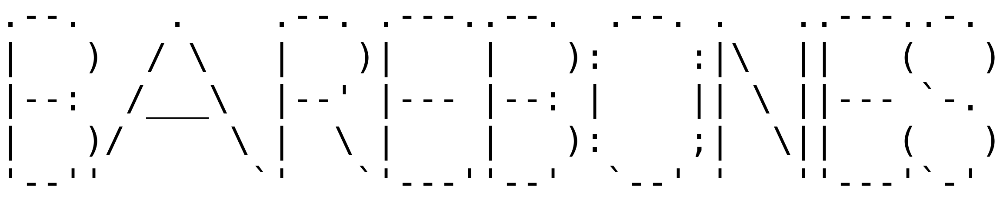
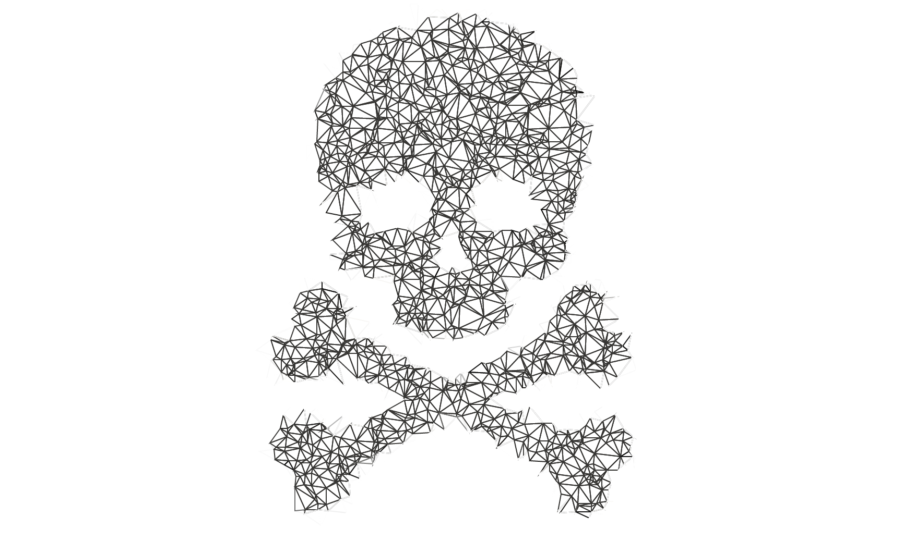

</img>

</img>

## Introduction

This is a compiler written entirely in C. In contrast to [Ohana](https://github.com/McCoyBecker/compilers-foundations/tree/master/ohana), which utilizes a lot of tooling and niceties from numerous Python packages and LLVM, each piece of Barebones is written from scratch in C. That means that it's unavoidable that we learn a little bit about x86-64 assembly, because we need to target it during code generation. In short, the hardest part of Ohana was constructing the lexer, the parser, and the AST data structure. The rest was "just use llvmlite and LLVM".
